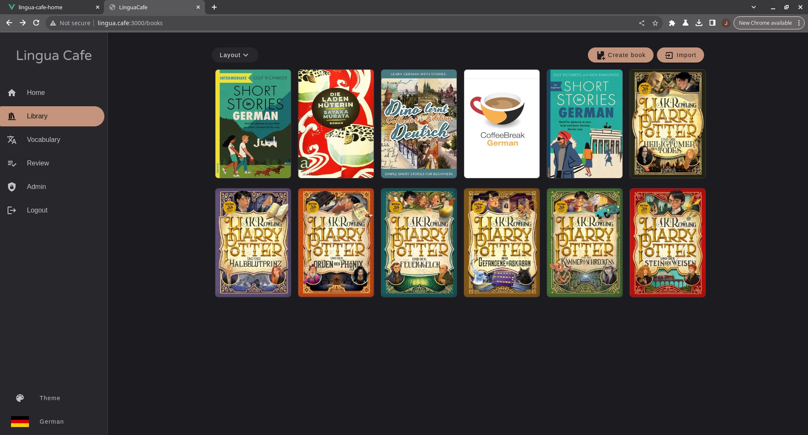
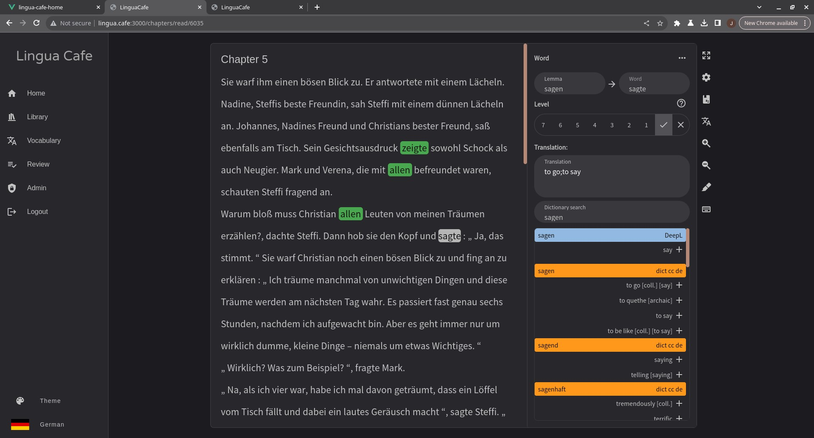
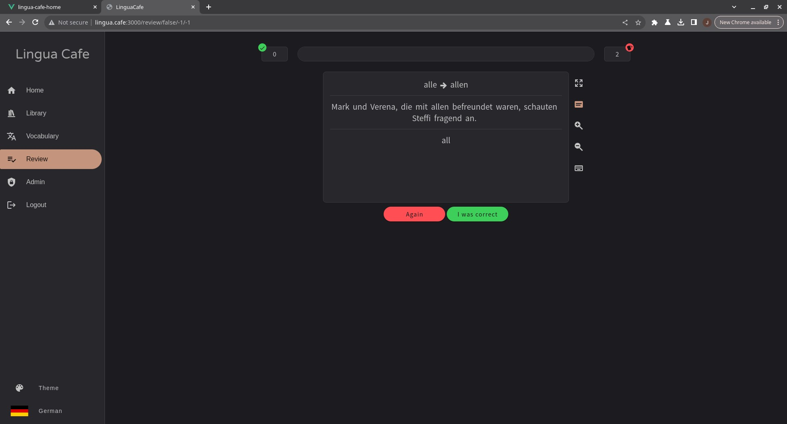
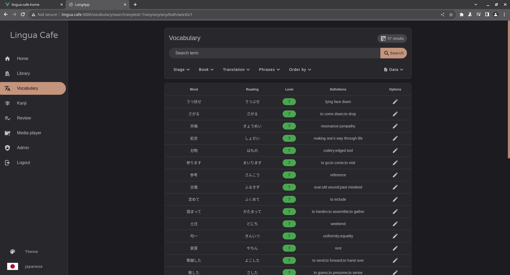

# Vimora

Vimora là một nền tảng tự host để học ngôn ngữ qua đọc hiểu. Ứng dụng giúp bạn nhập nội dung, tra từ ngay trong lúc đọc, lưu từ vựng và ôn tập lại bằng review.

Repo này là bản rebrand và tùy biến từ LinguaCafe, đã được chỉnh lại để chạy local bằng Docker, hỗ trợ branding `Vimora` và giao diện tiếng Việt.









## Tính năng chính

- Đọc văn bản ngay trên web với tra từ trong ngữ cảnh.
- Lưu từ vựng và theo dõi tiến độ học.
- Ôn tập từ đã lưu bằng chế độ review.
- Quản lý thư viện nội dung theo sách và chương.
- Hỗ trợ nhiều ngôn ngữ, trong đó có tiếng Trung, Hàn, Nhật, Đức và Anh.
- Chạy local bằng Docker để dễ dựng môi trường.

## Hỗ trợ ngôn ngữ

Dự án gốc hỗ trợ 27 ngôn ngữ:

- Chinese
- Croatian
- Czech
- Danish
- Dutch
- English
- Finnish
- French
- German
- Greek
- Italian
- Japanese
- Korean
- Latin
- Macedonian
- Norwegian
- Polish
- Portuguese
- Romanian
- Russian
- Slovenian
- Spanish
- Swedish
- Thai
- Turkish
- Ukrainian
- Welsh

Mức độ hỗ trợ giữa các ngôn ngữ có thể khác nhau tùy tokenizer, dictionary và dữ liệu liên quan.

## Công nghệ sử dụng

- Backend: Laravel 11, PHP 8.2
- Frontend: Vue 2, Vuetify 2, Laravel Mix
- Database: MySQL 8
- Cache/Queue: Redis
- Tokenizer service: Python
- Runtime: Docker Compose

## Chạy local

Yêu cầu:

- Docker Desktop
- Docker Compose

Tạo file cấu hình local:

```powershell
Copy-Item .env.docker-run.example .env.docker-run
Copy-Item .env.example .env
```

Lệnh chạy:

```powershell
docker compose --env-file .env.docker-run up -d
```

Truy cập:

```text
http://localhost:9191
```

Xem trạng thái container:

```powershell
docker compose --env-file .env.docker-run ps
```

Dừng hệ thống:

```powershell
docker compose --env-file .env.docker-run down
```

Build lại webserver sau khi sửa code:

```powershell
docker compose --env-file .env.docker-run build webserver
docker compose --env-file .env.docker-run up -d --force-recreate webserver
```

Nếu muốn đổi cổng chạy local, sửa biến `PORT` trong `.env.docker-run`.

## Cấu trúc dịch vụ Docker

- `vimora-webserver`: Laravel app + frontend assets
- `vimora-database`: MySQL
- `vimora-redis`: Redis
- `vimora-python-service`: tokenizer service

## Ghi chú phát triển

- Repo hiện được cấu hình để build `webserver` từ source local thay vì dùng image dựng sẵn.
- `package.json` đã được pin thêm `webpack` và `webpackbar` để tránh lỗi build asset với Laravel Mix.
- Dữ liệu MySQL được mount ở `docker/mysql-data` để không đụng vào thư mục source `database/`.

## Nguồn gốc dự án

Vimora được phát triển dựa trên LinguaCafe:

- Original project: https://github.com/simjanos-dev/LinguaCafe

Các chỉnh sửa trong repo này tập trung vào:

- đổi branding sang `Vimora`
- tinh chỉnh giao diện tiếng Việt
- tối ưu trải nghiệm chạy local bằng Docker

## License

Dự án này kế thừa giấy phép GPL-3.0 của project gốc. Xem file [LICENSE](./LICENSE).

## Acknowledgements

Trân trọng cảm ơn tác giả LinguaCafe và các thư viện, bộ dữ liệu mã nguồn mở đã tạo nền tảng cho dự án này.
